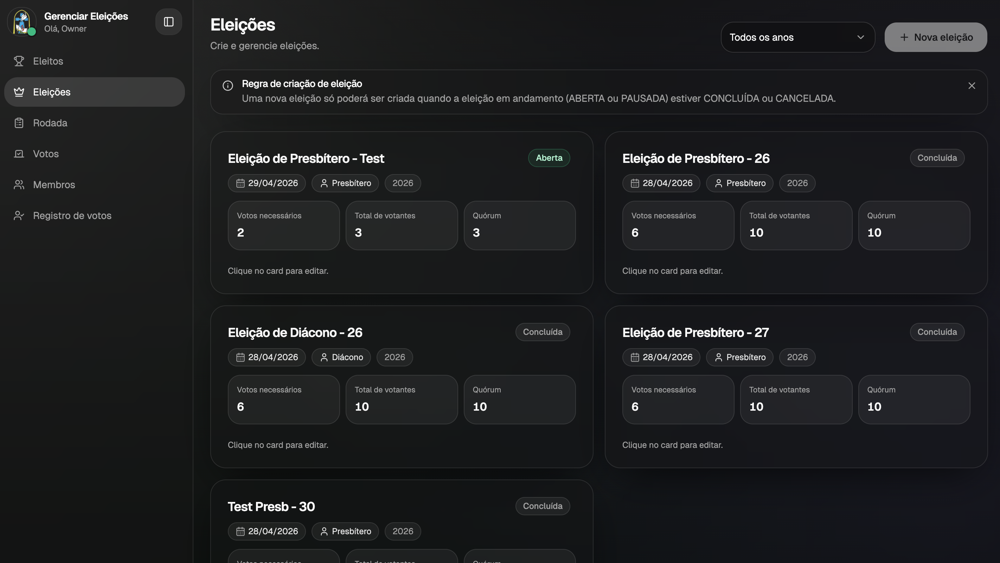
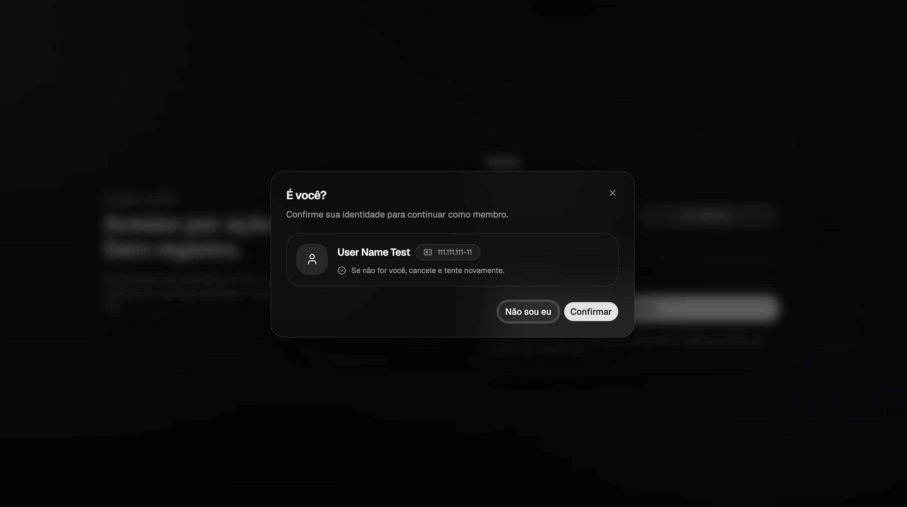
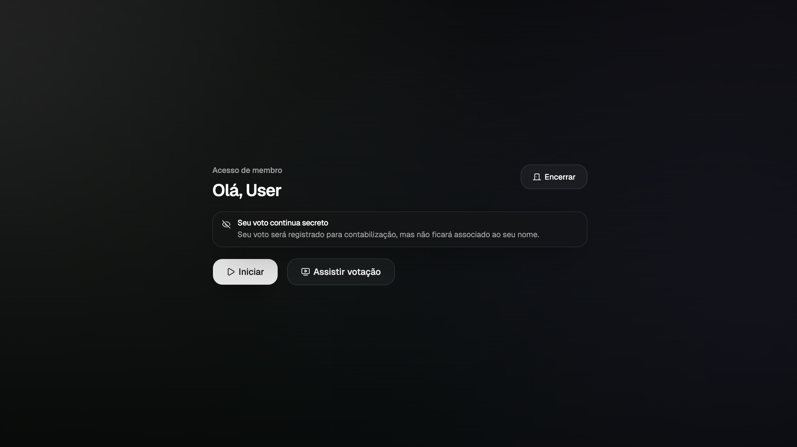

# Voting

Aplicação web para condução e apuração de votações com fluxo simplificado para membros (CPF) e área administrativa para gestão de eleições, rodadas e membros.

## Objetivo

Centralizar o processo de votação em uma interface simples, com:

- Identificação rápida do membro (CPF) sem criação de conta
- Seleção de eleições abertas e registro de votos
- Acompanhamento da apuração e consolidação de eleitos
- Gestão completa do ciclo eleitoral (admin)

## Tipos de usuários (3 perfis)

O sistema trabalha com três perfis de acesso:

- **Owner (Admin)**: entra por chave de acesso e possui autenticação administrativa. Pode gerenciar eleições, rodadas, membros, votos, registros e eleitos.
- **Staff (Representante)**: entra por chave de acesso, sem acesso ao painel administrativo. Atua no fluxo operacional (ex.: acompanhar votação e realizar confirmações quando habilitado).
- **Member (Membro)**: entra por CPF (identificação/validação na base de membros). Pode iniciar a votação, escolher a eleição aberta, votar e acompanhar a apuração.

## Principais funcionalidades

- **Login** por chave de acesso (admin/staff) ou CPF (membro)
- **Seleção de eleição** (somente eleições com status OPEN ficam disponíveis para votação)
- **Votação por rodadas**, com registro para contabilização (mantendo o voto desvinculado do nome na interface)
- **Tela de acompanhamento (watch)** para apuração e visualização do resultado
- **Painel administrativo** para gerenciar:
  - Eleições (criação/edição/cancelamento)
  - Rodadas (controle de status e andamento)
  - Membros (base de eleitores)
  - Votos e registro de votos
  - Eleitos (consolidação e decisões)

## Telas (exemplos)

Área administrativa (owner/admin):



Login de membro por CPF:



Área do membro (fluxo de votação):



## Stack e bibliotecas

- **Frontend**: React 19, TypeScript, Vite
- **Roteamento**: TanStack Router (file-based routes)
- **Estilização/UI**: Tailwind CSS v4, shadcn/ui, Radix UI, lucide-react
- **Formulários e validação**: React Hook Form, Zod
- **HTTP / Dados**: Axios
- **Backend (dados)**: Supabase (consumo via PostgREST em `/rest/v1`)
- **Utilitários**: dayjs (datas)

## Arquitetura (visão rápida)

- `src/pages`: rotas da aplicação (TanStack Router)
- `src/services`: camada de acesso a dados (requests para Supabase/PostgREST)
- `src/controllers`: regras de autenticação e orquestração de casos de uso
- `src/components`: componentes de UI e domínios (membros, rodadas, votos, apuração)
- `src/contexts`: estado global (usuário autenticado e toasts)

## Como rodar localmente

### Requisitos

- Node.js (LTS)
- npm

### Variáveis de ambiente

Crie um arquivo `.env` (ou `.env.local`) baseado em `.env-example`:

```bash
VITE_SUPABASE_URL=
VITE_SUPABASE_PUBLISHABLE_KEY=
```

### Instalação e execução

```bash
npm install
npm run dev
```

### Scripts úteis

- `npm run dev`: ambiente local
- `npm run build`: build de produção
- `npm run preview`: preview do build
- `npm run lint`: lint do projeto

## Deploy

Projeto configurado para SPA com Vercel (rewrites para `index.html`). Consulte [vercel.json](./vercel.json) para detalhes de build e output (`dist`).

## Próximas melhorias (roadmap)

- **TanStack Query**: migrar a camada de carregamento de dados (hoje baseada em `useEffect` + services) para TanStack Query, habilitando:
  - cache, deduplicação e invalidação consistente
  - refetch automático e estados de loading/error padronizados
- **Atualização em “tempo real” da eleição/apuração**: implementar atualização contínua sem refresh manual, combinando TanStack Query com:
  - `refetchInterval` (polling) como primeiro passo; e/ou
  - Supabase Realtime (assinaturas) para atualização instantânea quando houver novos votos/alterações de rodada.
